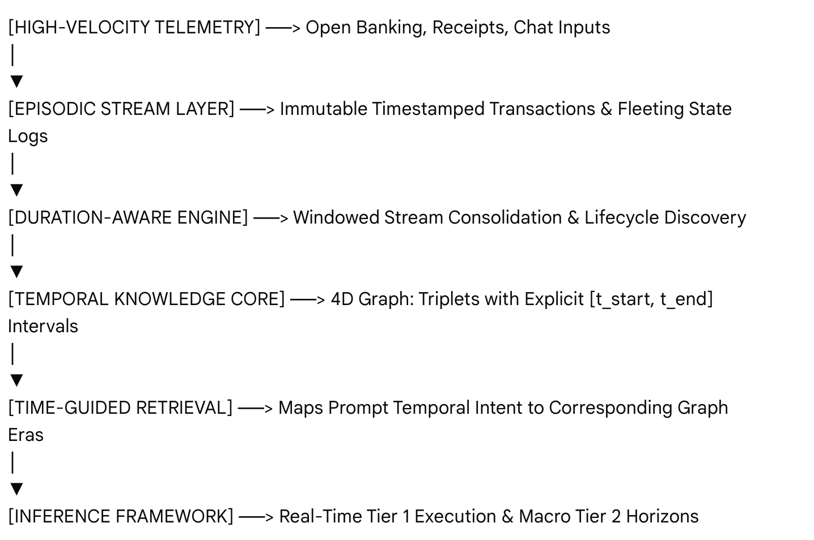

# Architectural Specification: Temporal Semantic Memory (TSM) Cognitive Architecture

### Production Blueprint for a Personalised Financial Advisor Agent

This document defines the systemic implementation of a split-memory LLM agent utilising a Temporal Semantic Memory (TSM) framework. The system transitions raw banking telemetry into a four-dimensional Temporal Knowledge Graph (TKG), tracking the duration, life cycle, and decay of financial habits to drive a two-tier personalization engine.

---

## 1. System Topology Overview

The system streams high-velocity transactions, abstracts them into durative intervals, and stores them inside a time-aware semantic layer. This eliminates batch-processing latency, prevents context window saturation, and resolves historical temporal queries natively.



---

## 2. Memory Layer Specifications

### 2.1 Episodic Memory Layer (The Event Log)

- **Purpose:** Records individual point-in-time activities, chronological chat inputs, and fleeting micro-sentiments.
- **Data Characteristics:** High-volume, short-lived, structurally immutable.
- **Infrastructure:** Chronological Vector Storage engine (e.g., Qdrant, Pinecone) indexed by explicit timestamps.

#### Schema Implementation Example

```json
{
  "id": "ep_9824_xyz",
  "timestamp": "2026-06-26T20:14:00Z",
  "metadata": {
    "category": "transaction",
    "sub_category": "food_delivery",
    "amount": 62.5,
    "user_sentiment": "stressed",
    "raw_text": "User processed late-night food order from UberEats after working late."
  }
}
```

### 2.2 Temporal Semantic Memory Layer (The Knowledge Core)

- **Purpose:** Tracks long-term targets, recurring liabilities, and dynamic habits bound to specific real-world timelines.
- **Data Characteristics:** Graph-structured, low-volume, highly durable, mutably updated via edge-capping.
- **Infrastructure:** Graph database (e.g., Neo4j) or Hybrid Vector Engine (e.g., PostgreSQL with pgvector) configured for interval-based relations.

#### Schema Implementation Example

```json
{
  "subject": "User(id=492)",
  "relation": "exhibits_pattern",
  "object": "High Stress Overspending (UberEats)",
  "temporal_interval": {
    "t_start": "2026-06-20T00:00:00Z",
    "t_end": null
  },
  "metadata": {
    "confidence_score": 0.89,
    "status": "active",
    "frequency": "4x_per_week"
  }
}
```

_Note: `t_end: null` implies the habit or state is currently ongoing and active._

---

## 3. Core TSM Operations

### 3.1 Duration-Aware Memory Construction (Continuous Consolidation)

Instead of rigid weekly cron jobs, the system runs an automated, windowed consolidation pipeline. It determines whether an episodic event is a point anomaly or an extension of a durative trend.

#### Prompt Specification: Durative Event Extraction

SYSTEM: You are the TSM Duration-Aware Memory Core of a financial intelligence platform.

TASK: Analyze the incoming stream of Episodic Logs against the User's Active Temporal Knowledge Graph.

CRITICAL DIRECTIONS:Determine if incoming actions extend an active habit, signify a lifestyle change, or represent a point anomaly.If an active pattern has ceased, cap the interval by setting "t_end" to the timestamp of the last observed event.If a new pattern is discovered, initialize it with "t_start". Do not duplicate open-ended intervals.

OUTPUT FORMAT: Return valid JSON matching the system schema containing only changes, closures, or new insertions.

### 3.2 Semantic-Time Guided Memory Retrieval

When a user queries the agent, the system passes the prompt through a parsing layer to isolate the **temporal intent** before fetching data.

1. **Prompt Parsing:** Extracts explicit dates (_"July 2025"_) or semantic phases (_"when I was transitioning between jobs last year"_).
2. **Graph Intersection:** Intersects the parsed target interval `[q_start, q_end]` with the graph edges where `t_start <= q_end` and `(t_end >= q_start OR t_end IS NULL)`.
3. **Context Construction:** Passes only the semantic profiles that were actively true during that specific era to the LLM.

---

## 4. Operational Dual-Tier Advice Matrix

### Tier 1: Short-Term Execution

- **Operational Scope:** Dynamic weekly cash flow, immediate friction adjustments, active pattern interventions.
- **Episodic Context:** Retains trailing 7 to 14 days of granular transaction logs.
- **Semantic Context:** Intersects current timestamp with open-ended `(t_end = null)` active habit loops and current month budget constraints.
- **Interface Action:** Real-time contextual warnings: _"Your late-night stress-spending pattern has been active for 6 days. Opt for groceries tonight."_

### Tier 2: Long-Term Horizon

- **Operational Scope:** Strategic multi-year wealth trajectories, macroeconomic changes, historical comparison over distinct financial eras.
- **Episodic Context:** Statistical aggregates of historical quarters.
- **Semantic Context:** Historical habit intervals matching specified query eras, multi-year goal milestones, and systemic wealth behaviors.
- **Interface Action:** Macro-structural reviews: _"During your job transition phase (May–Aug 2025), savings velocity dropped by 12%, but your current active trajectory hits your 2029 target early."_

---

## 5. Security & System Integrity Safeguards

1. **Native Eviction via Time-Capping:** Avoid data loss from hard-deleting obsolete habits. TSM evicts habits from active context windows simply by populating the `t_end` value. This preserves history for long-term reviews while keeping daily context windows clean.
2. **Context Bloat Abatement:** Never feed multi-month raw ledger files into the prompt context. Rely on the time-mapped durative summaries fetched by the Semantic-Time Guided Retrieval layer.
3. **Deterministic Math Safeguard:** LLM tokens cannot execute reliable arithmetic. Run all transaction metr

---

## 6. A python PoC

```zsh
pip install langgraph langchain-core langchain-openai pydantic
```

```python
import datetime
from typing import List, Optional, Dict, Any
from pydantic import BaseModel, Field
from langchain_core.prompts import ChatPromptTemplate
from langchain_openai import ChatOpenAI
from langgraph.graph import StateGraph, START, END

# Ensure you have your OPENAI_API_KEY environment variable set.
llm = ChatOpenAI(model="gpt-4o", temperature=0)

# ==========================================
# 1. SCHEMAS & MOCK TEMPORAL KNOWLEDGE GRAPH
# ==========================================

class TemporalIntent(BaseModel):
    """Schema for extracting explicit temporal ranges from user queries."""
    start_date: str = Field(description="ISO format date (YYYY-MM-DD) representing start of intent. Defaults to current date if current context requested.")
    end_date: Optional[str] = Field(description="ISO format date (YYYY-MM-DD) representing end of intent. Null implies ongoing/present day.")
    reasoning: str = Field(description="Brief explanation of how the temporal target was calculated.")

# Simulated Database containing a user's Temporal Knowledge Graph (TKG) records
MOCK_TKG_DATABASE = [
    {
        "subject": "User",
        "relation": "exhibits_pattern",
        "object": "High Stress Overspending (UberEats)",
        "t_start": "2025-05-10",
        "t_end": "2025-08-15",
        "summary": "Spent an extra $250/month on late-night takeout food delivery due to employment stress."
    },
    {
        "subject": "User",
        "relation": "exhibits_pattern",
        "object": "Aggressive ETF Compounding",
        "t_start": "2025-09-01",
        "t_end": None, # Null means active pattern
        "summary": "Consistently routes $1,500/month into broad-market index funds immediately on payday."
    },
    {
        "subject": "User",
        "relation": "exhibits_pattern",
        "object": "Frugal Groceries Focus",
        "t_start": "2026-01-10",
        "t_end": None, # Null means active pattern
        "summary": "Prepares weekly meals and keeps grocery costs under $80/week using dynamic local market discounts."
    }
]

# ==========================================
# 2. LANGGRAPH STATE DEFINITION
# ==========================================

class AgentState(BaseModel):
    user_query: str
    current_time: str = str(datetime.date.today())
    temporal_intent: Optional[TemporalIntent] = None
    retrieved_semantic_context: List[str] = []
    final_response: str = ""

# ==========================================
# 3. NODE DEFINITIONS
# ==========================================

def parse_temporal_intent_node(state: AgentState) -> Dict[str, Any]:
    """Node 1: Extract the semantic-time target window from the raw query."""
    intent_prompt = ChatPromptTemplate.from_messages([
        ("system", (
            "You are a temporal intent extractor for a financial AI agent.\n"
            "Analyze the user's query relative to the current date: {current_time}.\n"
            "Extract the window of time they are asking about."
        )),
        ("human", "{user_query}")
    ])

    # Force structured output adhering to the temporal intent schema
    structured_llm = llm.with_structured_output(TemporalIntent)
    chain = intent_prompt | structured_llm

    extracted_intent = chain.invoke({
        "current_time": state.current_time,
        "user_query": state.user_query
    })

    return {"temporal_intent": extracted_intent}


def retrieve_tsm_context_node(state: AgentState) -> Dict[str, Any]:
    """Node 2: Intersect query window with the 4D Temporal Knowledge Graph."""
    intent = state.temporal_intent

    # Parse extracted intent dates
    q_start = datetime.date.fromisoformat(intent.start_date)
    q_end = datetime.date.fromisoformat(intent.end_date) if intent.end_date else datetime.date.fromisoformat(state.current_time)

    matched_contexts = []

    for record in MOCK_TKG_DATABASE:
        t_start = datetime.date.fromisoformat(record["t_start"])
        t_end = datetime.date.fromisoformat(record["t_end"]) if record["t_end"] else datetime.date.fromisoformat(state.current_time)

        # Intersection Logic: Check if [t_start, t_end] overlaps with [q_start, q_end]
        if t_start <= q_end and t_end >= q_start:
            matched_contexts.append(
                f"- [{record['t_start']} to {record['t_end'] or 'Active'}]: {record['summary']}"
            )

    if not matched_contexts:
        matched_contexts.append("- No specific historic habit behaviors recorded during this exact timeline.")

    return {"retrieved_semantic_context": matched_contexts}


def generate_response_node(state: AgentState) -> Dict[str, Any]:
    """Node 3: Execute inference utilizing time-valid semantic context only."""
    context_str = "\n".join(state.retrieved_semantic_context)

    inference_prompt = ChatPromptTemplate.from_messages([
        ("system", (
            "You are an advanced TSM-driven personal financial advisor agent.\n"
            "The current real-world date is: {current_time}.\n\n"
            "Here are the user's valid habit and behavioral patterns active during the time period "
            "queried by the user:\n"
            "{context}\n\n"
            "Answer the user's question accurately. Do not reference habits outside this timeline "
            "unless explicitly comparing past patterns to current active patterns."
        )),
        ("human", "{user_query}")
    ])

    chain = inference_prompt | llm
    response = chain.invoke({
        "current_time": state.current_time,
        "context": context_str,
        "user_query": state.user_query
    })

    return {"final_response": response.content}

# ==========================================
# 4. COMPILING THE LANGGRAPH WORKFLOW
# ==========================================

workflow = StateGraph(AgentState)

# Add processing nodes
workflow.add_node("parse_temporal_intent", parse_temporal_intent_node)
workflow.add_node("retrieve_tsm_context", retrieve_tsm_context_node)
workflow.add_node("generate_response", generate_response_node)

# Set systemic execution sequence
workflow.add_edge(START, "parse_temporal_intent")
workflow.add_edge("parse_temporal_intent", "retrieve_tsm_context")
workflow.add_edge("retrieve_tsm_context", "generate_response")
workflow.add_edge("generate_response", END)

# Compile into executable agent runtime
tsm_agent = workflow.compile()

# ==========================================
# 5. EXECUTION AND VERIFICATION VERDICTS
# ==========================================

if __name__ == "__main__":
    # Test Scenario A: Historic Temporal Query (Evaluating dead, capped timeline)
    print("--- SCENARIO A: Historical Temporal Execution ---")
    query_a = "How did my lifestyle habits look while I was under that heavy work strain in June last year?"
    inputs_a = {"user_query": query_a, "current_time": "2026-06-26"}

    for output in tsm_agent.stream(inputs_a):
        for node, state in output.items():
            if "temporal_intent" in state and state["temporal_intent"]:
                print(f"[{node}] Target Window Matrix: {state['temporal_intent'].start_date} -> {state['temporal_intent'].end_date}")
            if "retrieved_semantic_context" in state and state["retrieved_semantic_context"]:
                print(f"[{node}] TSM Filtered Profiles:\n{chr(10).join(state['retrieved_semantic_context'])}")
            if "final_response" in state and state["final_response"]:
                print(f"\n[Final Agent Verdict]:\n{state['final_response']}\n")

    print("\n" + "="*50 + "\n")

    # Test Scenario B: Present Day Query (Evaluating open-ended, active timeline)
    print("--- SCENARIO B: Present Day Temporal Execution ---")
    query_b = "What do my current savings and grocery patterns look like right now?"
    inputs_b = {"user_query": query_b, "current_time": "2026-06-26"}

    for output in tsm_agent.stream(inputs_b):
        for node, state in output.items():
            if "temporal_intent" in state and state["temporal_intent"]:
                print(f"[{node}] Target Window Matrix: {state['temporal_intent'].start_date} -> {state['temporal_intent'].end_date}")
            if "retrieved_semantic_context" in state and state["retrieved_semantic_context"]:
                print(f"[{node}] TSM Filtered Profiles:\n{chr(10).join(state['retrieved_semantic_context'])}")
            if "final_response" in state and state["final_response"]:
                print(f"\n[Final Agent Verdict]:\n{state['final_response']}\n")

```

## 7. A practical use case for long term management

Here is how TSM manages the lifetime progression from age 30 to 40 using nested Primary Master Scenarios and temporary Mini-Scenarios, ensuring your advice engine is accurate, relevant, and properly decayed.


### 7.1 Establish overarching scenario

When the user finishes paying off their $28,000 debt at age 30, the TSM Duration-Aware Engine caps the Debt Elimination Era and registers the next Primary Scenario

```json
{
  "id": "era_wealth_accumulation_002",
  "type": "Primary_Scenario",
  "label": "Aggressive Asset Accumulation & Property Deposit Build",
  "temporal_interval": { "t_start": "2026-06-26", "t_end": null },
  "global_guardrails": {
    "target_savings_rate": "0.35 of net income",
    "primary_investment_vehicle": "Low-cost broad market ETFs"
  }
}
```

### 7.2 Nesting mini scenarios without distorting core plan

At age 32, the user decides to execute a Novated Car Lease or get married. In a standard LLM agent, this new prompt would flood the context window, causing the agent to forget the long-term ETF savings plan.TSM prevents this by spawning a Mini-Scenario Node that is explicitly linked to the parent timeline:

```json
{
  "id": "mini_novated_lease_045",
  "type": "Mini_Scenario",
  "parent_era_id": "era_wealth_accumulation_002",
  "label": "Novated Car Lease Allocation",
  "temporal_interval": { "t_start": "2028-03-12", "t_end": "2031-03-12" },
  "impact_vectors": {
    "monthly_cashflow_reduction": 750,
    "tax_optimization_status": "Active salary sacrifice"
  }
}
```

#### How Advice is Formulated During This State:

When providing advice on the car lease, Semantic-Time Guided Retrieval pulls both active nodes. The inference engine applies a strict structural priority: The Mini-Scenario must be optimized only using residual funds left over by the Primary Scenario's global guardrails.

TSM System Response:
"Your Primary Era goal requires a 35% savings rate ($2,042/month). Adding this Novated Lease Mini-Scenario consumes $750 of your monthly cash flow. This fits entirely within your discretionary buffer, meaning your core property deposit goal remains entirely undisturbed."

### 7.3 Decaying Context Automatically (Natural Capping)

Fast-forward to age 34: the car lease reaches its maturity date (2031-03-12).Instead of deleting the data or letting it corrupt the current vector prompt space, the TSM Consolidation Layer automatically updates the node status

```json
// The context decays out of active retrieval because current_time > t_end
{
  "id": "mini_novated_lease_045",
  "temporal_interval": { "t_start": "2028-03-12", "t_end": "2031-03-12" },
  "status": "expired"
}
```

The next day, if the user asks about their monthly budget, the lease context is natively decayed and hidden. The agent is no longer distracted by old lease variables, keeping the prompt clean and highly cost-efficient

### 7.4 Shifting to the Next Primary Scenario (Transitioning to Age 40)

By age 40, the user has built their property deposit and purchased a home. The Asset Accumulation Era has achieved its outcome. TSM caps the parent interval (t_end: "2036-01-01") and triggers the next major life phase:

```json
{
  "id": "era_mortgage_acceleration_003",
  "type": "Primary_Scenario",
  "label": "Mortgage Minimization & Family Risk Protection Era",
  "temporal_interval": { "t_start": "2036-01-01", "t_end": null }
}
```

### The Retrieval Verification Rule

When a 40-year-old user interacts with the system, the Time-Guided Query Parser maps their current system clock:

1. **Current Status Query** (_"Review my current allocations"_): System queries the TKG for elements where t_end IS NULL. It fetches the Mortgage Minimization Era and any current active mini-scenarios (e.g., child school fees). The agent is completely unburdened by the car lease details from 8 years ago.
2. **Historical Trend Query** (_"How did my disposable cash flows change during my late 20s vs my late 30s?"_): TSM opens its historical context filter and fetches the old summaries from both completed eras. The agent constructs a time-accurate comparative report without needing access to a single raw ledger line from 2026.
